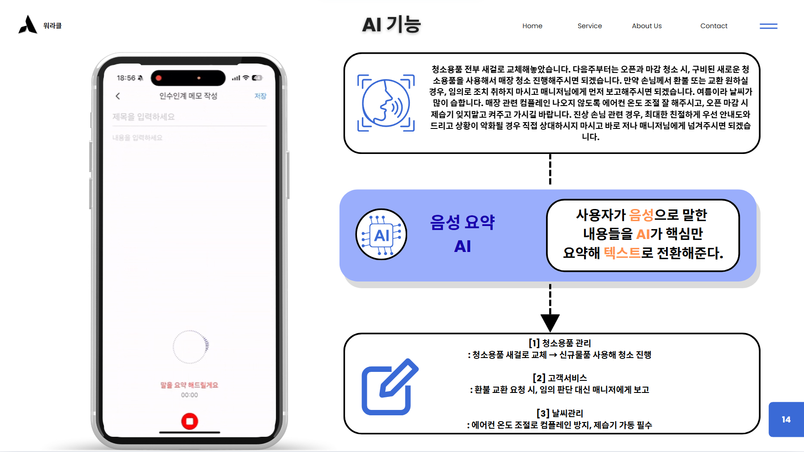
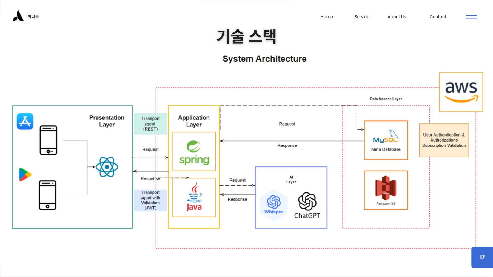
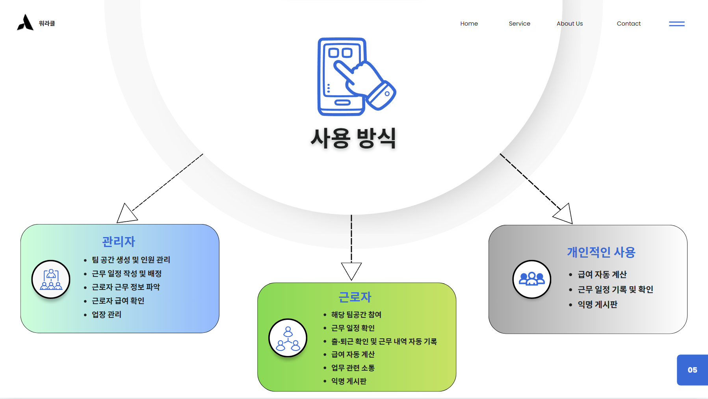
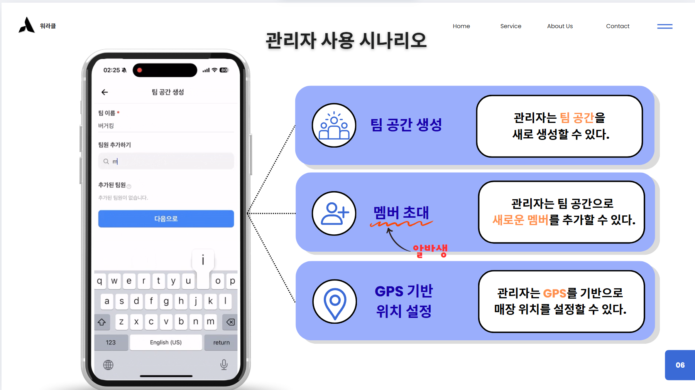
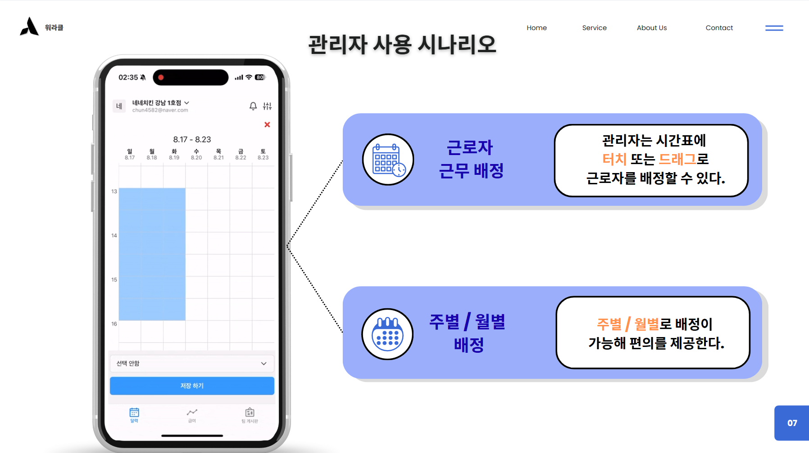
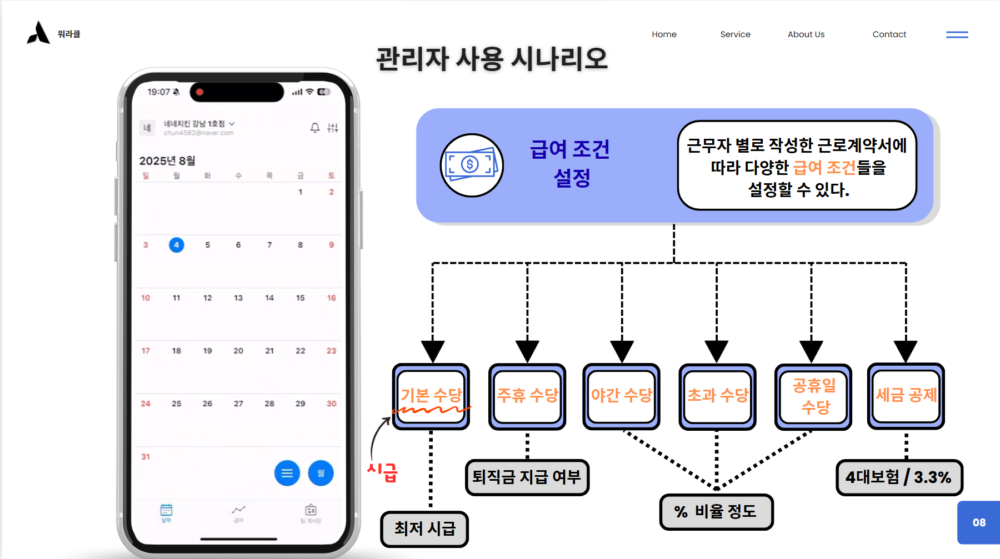
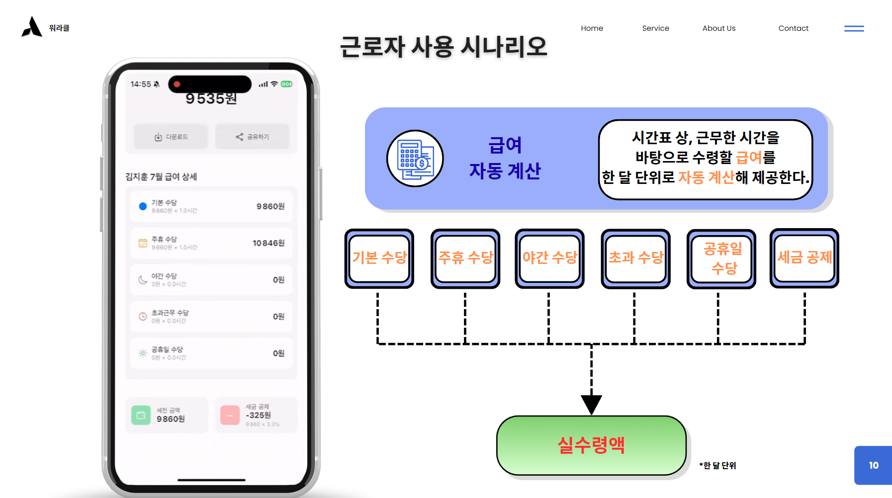
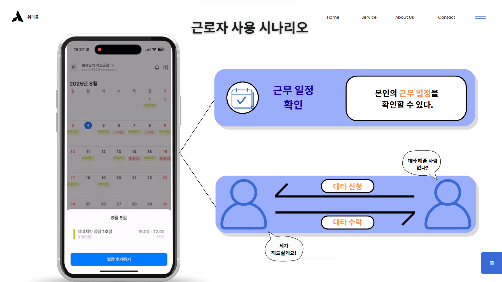
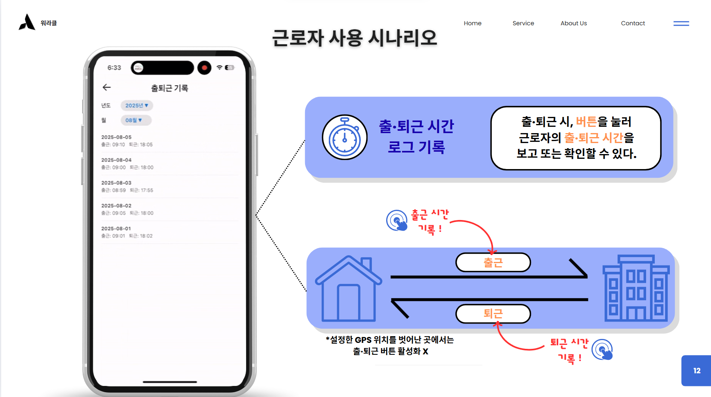

# 🤖 CheckPoint 앱

 
 
 

## 📌 주요 기능

* **AI 출퇴근 확인**: AI 얼굴 인식을 통해 근로자의 출퇴근을 정확하게 기록하고 관리합니다.
* **간편한 급여 계산**: 근무 시간과 급여 정보를 자동으로 연동하여 정확한 급여를 계산합니다.
* **실시간 근무 기록**: 근로자와 관리자 모두 실시간으로 근무 기록을 확인하고 관리할 수 있습니다.

 
 
 

---

## 💻 기술 스택

이 프로젝트는 다음과 같은 기술을 사용했습니다.

 
 
 

---

## 🛠️ 사용 방식

 
 
 

---

## 👩‍💼 관리자 사용 시나리오

 

 

 
 
 

---

## 👨‍🏭 근로자 사용 시나리오

 

 

